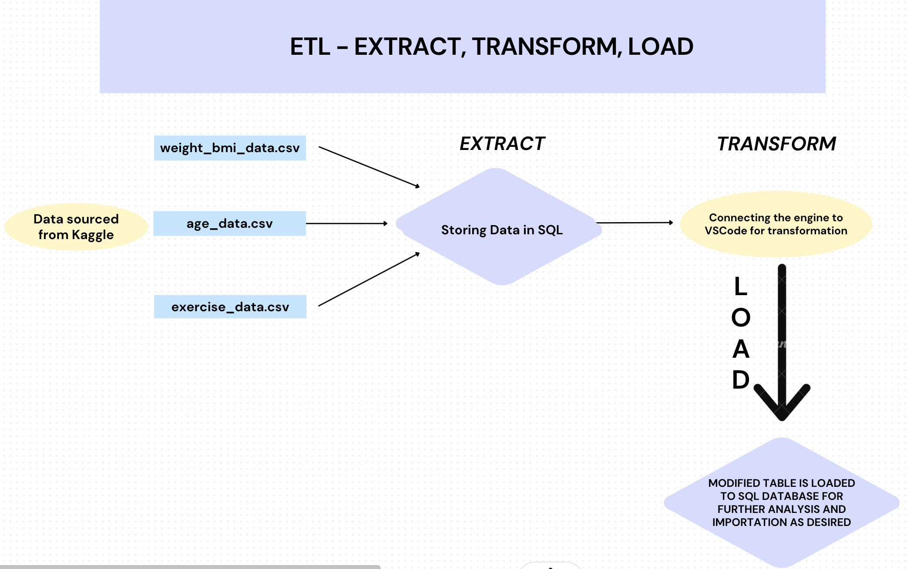
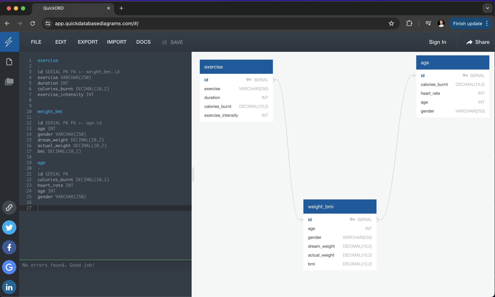

# *Sweatin' & Spreadsheets: An Analysis of Exercise Efforts* :running: :sweat_drops: :weight_lifting_woman: 

**In this project, we embark on a journey through a vast dataset, harnessing the tools of SQL and the agility of Jupyter Nootebook to mold and manipulate our data. Our mission? To sculpt and reshape the dataset into meaningful insights, employing prowess of Pandas and other Python libraries along the way.**

#### Data Preparation and  Tasks
For this project, we curated data sourced from Kaggle. After refining the raw data into a more manageable format, we converted it into 3 CSV files. 
Our subsequent actions included importing this data into SQL databases, establishing a robust foundation for in-depth analysis within Jupyter Notebook and loading converted and cleaned data back into the server. Through meticulous cleaning and merging processes, we ensured data cohesion, guaranteeing that it is primed and prepared for thorough analytical exploration.

The pipeline of the data extraction process was visually represented using a graph, illustrating the sequential steps involved in sourcing, refining, and importing the data:

## Data Extraction step by step:

* We set a new database.
* Created tables using schemata.
* Imported required CSV files into respective tables.
* Verified that tables got correctly populated.
* Created an engine connection to our SQL database for further transformation.

## Data Transformation step by step:

* Merged table 'exercise_df' and 'age_df' on 'id', 'calories_burnt'.

* Merged result table with the 3rd table 'weight_bmi_df' table on 'id', 'age', 'gender’.

* Rearranged and ordered columns.

* Renamed columns.

* Changing datatypes to floats and integer for easier numerical manipulation.

* Normalising calories burnt by each participant to calories burnt in 60 minutes utilising the Exercise Duration (Minute) and Calories Burnt (Cal) data into a new column.

* Rounding decimal values and updating the data frame.

* Changing gender entries to binary 'Female': 1, 'Male': 0 for ease of numerical analysis.

* Finding the Average 'Calories Burnt (60 min)’ for each exercise type.

* Finding top 2 highest average 'Calories Burnt (60 min)' for each exercise type.

* Analysing ratio of participants from each gender for each exercise type to determine validity of further analysis of correlations and comparability.

* Confirming approximate 50%-50% ratio of male and female participants for the top 2 exercises burning highest average calories within 60 minutes duration.

* Filtering original table to include data for the 2 nominated exercise types and reducing the data size by 80% for the final data frame.

* Exported final table format as a CSV file.

## Data Loading: 

* We created an empty table named: "table_cleaned_test" for further test of new CSV file importation.
* Loaded the table with CSV file to guarantee success for future users.
* Exported cleaned and transformed, final panda dataframe into our SQL database ready for analysis.

## User Interface Function:

This function provides a user-friendly interface for interacting with data analysis tools. It prompts the user to choose specific columns from a dataset, select a sorting method, specify a row limit, and offers options to save the filtered data as a CSV file or load it into a SQL database. Additionally, it allows users to visualize the analysis plot and save the plot for future reference.

*Key Features:*

1. Column Selection:

* Users can choose columns of interest from the dataset for analysis.

2. Sorting Method:

* Provides options for sorting the data based on specific criteria chosen by the user.

3. Row Limit:

* Allows users to specify a limit on the number of rows to be displayed or analyzed.

4. CSV Export:

* Offers the functionality to save the filtered data as a CSV file for external use.

5. SQL Database Integration:

* Provides the option to load the filtered data directly into a SQL database for further analysis or storage.

6. Analysis Plot Visualization:

* Enables users to visualize the analysis plot generated from the selected data columns.

7. Plot Saving:

* Allows users to save the generated plot for future reference or sharing.

8. Usage:

* Users interact with the function through a series of prompts and input selections.

* The function guides users through each step, ensuring a seamless and intuitive experience.

Benefits:

* Streamlines the data analysis process by providing a consolidated interface for various analysis tasks.

* Enhances user control and flexibility in exploring and analyzing datasets.

* Simplifies data visualization and sharing, enabling efficient communication of insights.

**Overall, this function serves as a versatile tool for data exploration and analysis, empowering users to derive valuable insights from their datasets with ease.**

### Ethical Considerations
The selected dataset is synthetic, ensuring the protection of individual's privacy and adhering to ethical principles. By opting for synthetic data, privacy concerns associated with the use of real world data are effectively mitigated. This choice alligns with ethical standards, prioritizing the safeguard of personal information while enabling meaningful analysis and insights to be derived.

### *User Instructions*

*Welcome to our data analysis project! In this journey, we'll navigate through a vast dataset, using the powerful tools of SQL and the flexibility of Jupyter Notebook to shape and mold our data into meaningful insights. Our mission is to uncover hidden patterns and trends, leveraging the prowess of Pandas and other Python libraries along the way.*

**Option 1 Instructions:**

1. Download Resources:

* Download the CSV files and SQL schemata provided in the Resources folder.

2. Import Data:

* Use the provided schemata to import data into corresponding tables and populate them with the downloaded CSV files.

3. Set Up Jupyter Notebook:

* Download our Jupyter Notebook file.

* Open the notebook and replace the placeholders ('username', 'password', 'hostname', 'port', and 'database_name') with your PostgreSQL credentials.

* Create a connection string and engine using your credentials.
Test the connection to ensure its success.

4. Run Code:

* Once the connection is successful, feel free to run the remaining codes in the notebook.

5. Export Final Table:

* Use the code provided to export the final and cleaned table back into your database for further analysis as desired.

**Option 2 Instructions:**

1. Download Resources:

* Download the CSV files, SQL schemata, and the `Final_Cleaned_Data.csv` from the Resources folder.

2. Import Data:

* Use the provided schemata to import data into corresponding tables and populate them with the downloaded CSV files.

Note: The last created table is the final version of contained data.

3. Set Up Jupyter Notebook:

* Open a new Jupyter Notebook and download our Jupyter Notebook file.
Replace the placeholders ('username', 'password', 'hostname', 'port', and 'database_name') with your PostgreSQL credentials.

* Create a connection string and engine using your credentials.

* Test the connection to ensure its success.

4. Data Analysis:

* Your data is now ready for analysis.

* Explore the dataset and perform any desired analyses using the provided notebook.

Please, see the `User Interface Function` description for more insight on how to interact with the code.

With these user instructions, you're now equipped to embark on your data analysis journey. Happy exploring! 

#### Technologies used
* *Visual Studio Code - **Python** Software*
* *Excel* 
* *GitHub* 
* **Pandas**
* **Jupyter Notebook**
* **SQL**
* **Seaborn**
* **Alstair**

#### File list
* main_codes.ipynb
* age_data.csv - resources file containing dataset
* weight_bmi.csv - resources file containing dataset
* exercise_data.csv - resources file containing dataset
* fitness_schemata.sql
* README.md
* screen_shots folder with various Screen Shots
* output_folder - with various files
* SQL imports - folder containing proof of successful table population in pgAdmin

* user_interface.ipynb

#### Resources & Links:

Kaggle - A report using large dataset of fitness and exercise metrics. 
`https://www.kaggle.com/datasets/aakashjoshi123/exercise-and-fitness-metrics-dataset`

Cover Photo Source: `https://www.google.com/url?sa=i&url=https%3A%2F%2Fwww.vecteezy.com%2Fvector-art%2F4761631-healthy-families-concept-isolated-person-situations-collection-of-scenes-with-people-parents-with-children-go-in-for-sports-compete-and-active-lifestyle-mega-set-vector-illustration-in-flat-design&psig=AOvVaw0w0ooOd7TrbqvSQoh-N53a&ust=1711527016814000&source=images&cd=vfe&opi=89978449&ved=0CBIQjRxqFwoTCLj-h7K9kYUDFQAAAAAdAAAAABAT`

Exercise GIF source: `https://i.gifer.com/7kvp.gif`
 
Homer GIF source: `https://i.giphy.com/media/3orif0rjs49gsPWg1y/giphy.gif`
##### Copyright
A. Czynszak, A. Yazdan, C. Ramos, C.Y. Lee © 2024. All Rights Reserved.

